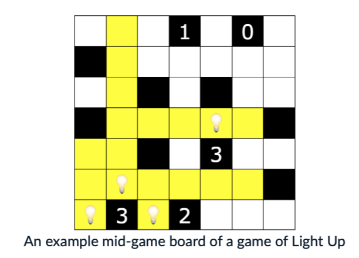

## Lab02 - Exercise - Light Up: Board State (3 points)

This question is about a game called [Light Up](https://groklearning.github.io/problem-helpers/light-up/). A board of Light Up consits of a `N x N` 2D square grid of black and white squares. Lamps illuminate yellow every square in the same row or column until they hit a black cell or the edge of the board.



The placement of lamps is governed by two rules:

* no to lamps are in NSEW (North/South/East/West) line-of-sight of each other;
* black cells with numbers must have less than or equal to that many lamps as direct NSEW adjacent neighbours.

A game of Light Up is solved when the above rules are satisfied, and:

* all black cells with numbers must have *exactly* that many maps as direct NSEW adjacent neighbours;
* all white cells are illuminated yellow.

For this problem, you need to write a program in `lightup.py` to determine whether a board of Light Up is in a **happy**, **unhappy** or **solved** state. A board is considered **unhappy** if either of the rules are broken. A board is considered **happy** if no rules are broken. A board is considered **solved** if no rules are broken and the solved contitions are met.

You need to implement a function `get_board_state(board)` which takes the board as a list of strings, and returns the string `'happy'`, `'unhappy'`, or `'solved'`, depending on what state the provided board is in.

The board is encoded the following fashion:

* white cells are `.`;
* black unnumbered cells are `X`;
* black numbered cells are the number (between `0` and `4`) inclusive
* lamp cells are `'L'`.

There is an [online version of light up](https://groklearning.github.io/problem-helpers/light-up/) for you to play with to get a better feel for the game, and to clarify any ambiguities as to what is *happy*, *unhappy* and *solved*.

Here are some examples. These test cases are provided in a format that is directly copyable to the online version of Light Up.

```python
# Example board, happy state.
print(get_board_state('''
...1.0.
X......
..X.X..
X...L.X
..X.3..
.L....X
L3L2...'''.strip().split('\n')))
# Example board, solved state.
print(get_board_state('''
..L1.0.
X...L..
L.X.X.L
X...L.X
..XL3L.
.L....X
L3L2L..'''.strip().split('\n')))
# Example board, unhappy state.
print(get_board_state('''
L..1L0.
X.L....
L.X.X.L
X...L.X
..XL3L.
.L....X
L3L2L..'''.strip().split('\n')))
# Different board, happy state.
print(get_board_state('''
L1.L.
..L3L
..X1.
.1...
.....'''.strip().split('\n')))
```

```
happy
solved
unhappy
happy
```

Hint: Helper functions are your friend.

Problem sourced from Grok Learning NCSS Challenge (Advanced), 2017.
