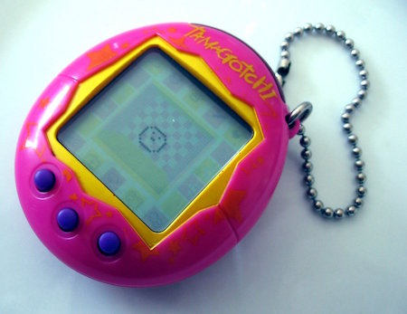

## Lab04 - Exercise - Tamagotchi (3 points)

Sometimes a new toy will become a craze. You probably saw it happen with fidget spinners, but back in the late 90s and early 2000s, it was the [Tamagotchi](https://en.wikipedia.org/wiki/Tamagotchi).



A Tamagotchi simulates having a small alien pet. You could feed it (but not too much), play with it, clean up after it, and train it. If you kept it alive, over time, it would grow up.

You've been given a `Tamagotchi` class in the file `tamagotchi.py`. You don't need to understand how this class works - you just need to use it. Your task is to use this class to build a multi-tamagotchi game.

Here's how to use the `Tamagotchi` class.

```python
from tamagotchi import Tamagotchi

fluffy = Tamagotchi('Fluffy the Three Headed Dog')
print(fluffy)
fluffy.feed()
fluffy.increment_time()
print(fluffy)
```

In this example, we create a new Tamagotchi (giving it the name `'Fluffy the Three Headed Dog'`), feeding it and using the `increment_time` method to simulate time passing.

Your game should let the user enter commands one at a time, then **stop when an empty string is entered**. The commands to implement are:

* `create <name>`
* `feed <name>`
* `play <name>`
* `wait`

Since this is a multi-tamagotchi game, each command (except `wait`) needs the name of the Tamagotchi on which to act. Tamagotchi names will not contain spaces.

The `create` command creates a new Tamagotchi with the given name, the `feed` and `play` commands should call the `feed` and `play` methods on the correct Tamagotchi. The `wait` command does nothing, but time passes as normal (see below).

The program should print out `'Invalid command.'` if the command entered is not one of the four values. For the commands which specify a Tamagotchi by name, if the Tamagotchi has not been created it should say `'No Tamagotchi with that name.'`. You cannot create a new Tamagotchi with the same name as an existing Tamagotchi unless it is dead. If the Tamagotchi already exists and is not dead, print `'You already have a Tamagotchi called that.'`.

In the game, each command also causes time to pass. After each command (if it is a valid command), print out the current state of each Tamagotchi in sorted order by name, and then call the `increment_time` method to pass time for all Tamagotchi.

If:
* The command is unknown;
* An unknown named Tamagotchi is provided to a known command; or
* A not-yet-dead Tamagotchi is provided to the `create` command,

your program should ask the user for the next command without printing out the state of the Tamagotchi or incrementing time.


Here is an example with one Tamagotchi:

```txt
Command: create fluffy

 _____
/ ^_^ \
\_____/
Name:    fluffy
Hunger:  ooooo
Boredom:
Age:     0

Command: wait

 _____
/ ^_^ \
\_____/
Name:    fluffy
Hunger:  oooooo
Boredom: o
Age:     1

Command: feed fluffy

 _____
/ ^_^ \
\_____/
Name:    fluffy
Hunger:  oooo
Boredom: oo
Age:     2

Command: play fluffy
   _______
  /       \
 /  ^ _ ^  \
 \_________/
    U   U
Name:    fluffy
Hunger:  ooooo
Boredom:
Age:     3

Command:
```

And here's a longer example with multiple simultaneous Tamagotchi:

```txt
Command: feed buckbeak
No Tamagotchi with that name.
Command: quirrell
Invalid command.
Command: create buckbeak

 _____
/ ^_^ \
\_____/
Name:    buckbeak
Hunger:  ooooo
Boredom:
Age:     0

Command: create norbert

 _____
/ ^_^ \
\_____/
Name:    buckbeak
Hunger:  oooooo
Boredom: o
Age:     1


 _____
/ ^_^ \
\_____/
Name:    norbert
Hunger:  ooooo
Boredom:
Age:     0

Command: create aragog

 _____
/ ^_^ \
\_____/
Name:    aragog
Hunger:  ooooo
Boredom:
Age:     0


 _____
/ ^_^ \
\_____/
Name:    buckbeak
Hunger:  ooooooo
Boredom: oo
Age:     2


 _____
/ ^_^ \
\_____/
Name:    norbert
Hunger:  oooooo
Boredom: o
Age:     1

Command: feed buckbeak

 _____
/ ^_^ \
\_____/
Name:    aragog
Hunger:  oooooo
Boredom: o
Age:     1

   _______
  /       \
 /  ^ _ ^  \
 \_________/
    U   U
Name:    buckbeak
Hunger:  ooooo
Boredom: ooo
Age:     3


 _____
/ ^_^ \
\_____/
Name:    norbert
Hunger:  ooooooo
Boredom: oo
Age:     2

Command: feed norbert

 _____
/ ^_^ \
\_____/
Name:    aragog
Hunger:  ooooooo
Boredom: oo
Age:     2

   _______
  /       \
 /  ^ _ ^  \
 \_________/
    U   U
Name:    buckbeak
Hunger:  oooooo
Boredom: oooo
Age:     4

   _______
  /       \
 /  ^ _ ^  \
 \_________/
    U   U
Name:    norbert
Hunger:  ooooo
Boredom: ooo
Age:     3

Command: feed aragog
   _______
  /       \
 /  ^ _ ^  \
 \_________/
    U   U
Name:    aragog
Hunger:  ooooo
Boredom: ooo
Age:     3

   _______
  /       \
 /  ^ _ ^  \
 \_________/
    U   U
Name:    buckbeak
Hunger:  ooooooo
Boredom: ooooo
Age:     5

   _______
  /       \
 /  ^ _ ^  \
 \_________/
    U   U
Name:    norbert
Hunger:  oooooo
Boredom: oooo
Age:     4

Command: play buckbeak
   _______
  /       \
 /  ^ _ ^  \
 \_________/
    U   U
Name:    aragog
Hunger:  oooooo
Boredom: oooo
Age:     4

   ___________
  /           \
 /  /\     /\  \
 \      _      /
  \___________/
    \_/   \_/
Name:    buckbeak
Hunger:  oooooooo
Boredom: o
Age:     6

   _______
  /       \
 /  ^ _ ^  \
 \_________/
    U   U
Name:    norbert
Hunger:  ooooooo
Boredom: ooooo
Age:     5

Command: feed buckbeak
   _______
  /       \
 /  ^ _ ^  \
 \_________/
    U   U
Name:    aragog
Hunger:  ooooooo
Boredom: ooooo
Age:     5

   ___________
  /           \
 /  /\     /\  \
 \      _      /
  \___________/
    \_/   \_/
Name:    buckbeak
Hunger:  oooooo
Boredom: oo
Age:     7

   ___________
  /           \
 /  /\     /\  \
 \      _      /
  \___________/
    \_/   \_/
Name:    norbert
Hunger:  oooooooo
Boredom: oooooo
Age:     6

Command: feed buckbeak
   ___________
  /           \
 /  /\     /\  \
 \      _      /
  \___________/
    \_/   \_/
Name:    aragog
Hunger:  oooooooo
Boredom: oooooo
Age:     6

   ___________
  /           \
 /  /\     /\  \
 \      _      /
  \___________/
    \_/   \_/
Name:    buckbeak
Hunger:  oooo
Boredom: ooo
Age:     8

   ___________
  /           \
 /  /\     /\  \
 \      _      /
  \___________/
    \_/   \_/
Name:    norbert
Hunger:  ooooooooo
Boredom: ooooooo
Age:     7

Command: feed aragog
   ___________
  /           \
 /  /\     /\  \
 \      _      /
  \___________/
    \_/   \_/
Name:    aragog
Hunger:  oooooo
Boredom: ooooooo
Age:     7

   ___________
  /           \
 /  /\     /\  \
 \      _      /
  \___________/
    \_/   \_/
Name:    buckbeak
Hunger:  ooooo
Boredom: oooo
Age:     9

   ___________
  /           \
 /  /\     /\  \
 \      _      /
  \___________/
    \_/   \_/
Name:    norbert
Hunger:  oooooooooo
Boredom: oooooooo
Age:     8

Command: play aragog
   ___________
  /           \
 /  /\     /\  \
 \      _      /
  \___________/
    \_/   \_/
Name:    aragog
Hunger:  ooooooo
Boredom: ooo
Age:     8

   ___________
  /           \
 /  /\     /\  \
 \      _      /
  \___________/
    \_/   \_/
Name:    buckbeak
Hunger:  oooooo
Boredom: ooooo
Age:     10


Name:    norbert
DEAD

Command: feed buckbeak
   ___________
  /           \
 /  /\     /\  \
 \      _      /
  \___________/
    \_/   \_/
Name:    aragog
Hunger:  oooooooo
Boredom: oooo
Age:     9

   ___________
  /           \
 /  /\     /\  \
 \      _      /
  \___________/
    \_/   \_/
Name:    buckbeak
Hunger:  oooo
Boredom: oooooo
Age:     11


Name:    norbert
DEAD

Command: feed aragog
   ___________
  /           \
 /  /\     /\  \
 \      _      /
  \___________/
    \_/   \_/
Name:    aragog
Hunger:  oooooo
Boredom: ooooo
Age:     10

   ___________
  /           \
 /  /\     /\  \
 \      _      /
  \___________/
    \_/   \_/
Name:    buckbeak
Hunger:  ooooo
Boredom: ooooooo
Age:     12


Name:    norbert
DEAD

Command: feed buckbeak
   ___________
  /           \
 /  /\     /\  \
 \      _      /
  \___________/
    \_/   \_/
Name:    aragog
Hunger:  ooooooo
Boredom: oooooo
Age:     11

   ___________
  /           \
 /  /\     /\  \
 \      _      /
  \___________/
    \_/   \_/
Name:    buckbeak
Hunger:  ooo
Boredom: oooooooo
Age:     13


Name:    norbert
DEAD

Command: play aragog
   ___________
  /           \
 /  /\     /\  \
 \      _      /
  \___________/
    \_/   \_/
Name:    aragog
Hunger:  oooooooo
Boredom: oo
Age:     12

   ___________
  /           \
 /  /\     /\  \
 \      _      /
  \___________/
    \_/   \_/
Name:    buckbeak
Hunger:  oooo
Boredom: ooooooooo
Age:     14


Name:    norbert
DEAD

Command: feed buckbeak
   ___________
  /           \
 /  /\     /\  \
 \      _      /
  \___________/
    \_/   \_/
Name:    aragog
Hunger:  ooooooooo
Boredom: ooo
Age:     13

   ___________
  /           \
 /  /\     /\  \
 \      _      /
  \___________/
    \_/   \_/
Name:    buckbeak
Hunger:  oo
Boredom: oooooooooo
Age:     15


Name:    norbert
DEAD

Command: play aragog
   ___________
  /           \
 /  /\     /\  \
 \      _      /
  \___________/
    \_/   \_/
Name:    aragog
Hunger:  oooooooooo
Boredom:
Age:     14


Name:    buckbeak
DEAD


Name:    norbert
DEAD

Command: wait

Name:    aragog
DEAD


Name:    buckbeak
DEAD


Name:    norbert
DEAD

Command:
```

You cannot change the `Tamagotchi` class - you can only rely on the public methods and should treat it as a black-box. Assume that the internal attributes will change during marking as we substitute the `Tamagotchi` class given to you here with an alternative implementation with the same interface (methods) but different internal attributes.

Problem sourced from NCSS Challenge (Advanced), 2017.
