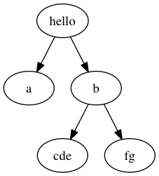

## Lab04 - Exercise - Draw Me a Tree (4 points)

### Trees

If you have not taken COMP2521, this link explains [trees](https://www.freecodecamp.org/news/all-you-need-to-know-about-tree-data-structures-bceacb85490c/) in Computer Science.

### Problem

There are many ways to represent trees programatically. One way is to use nested lists (or nested tuples). Here is some Python code which can represent the example tree below:

```python
tree = ("hello", (("a", ()), ("b", (("cde", ()), ("fg", ())))))
```

or, with a bit more whitespace:

```python
tree = ("hello", (
         ("a", ()),
         ("b", (
           ("cde", ()),
           ("fg", ())))))
```

As you can see, we can represent each node as a 2-tuple with the first element being the label of the node, and the second element being a tuple of its children.



Your task is to write a function `draw(tree)` which takes in a tree of this format, and print out an ASCII representation of the tree. Some rules about printing:

* The tree should be drawn in a box that is just tight enough to fit the tree
* Each note should be drawn as `[<label>]`
* The children of a node `n` should appear directly below `n` and be as tightly packed as possible
* The parent should be wide enough to cover all of its children and grandchildren. Extra unused space after the `<label>` and before the `]` should be filled with underscores (`_`)
* Unused cells in the box should be filled in with periods (`.`)

Here are two examples:

```
>>> tree("hello", (("a", ()), ("b", (("cde", ()), ("fg", ())))))
[hello_____]
[a][b______]
...[cde][fg]
```

```
>>> tree("supercalifragilisticexpialidocious",(("a",(("b",(("candy",()),)),("onomatopoeia",()),)),("d",(("egg",(("f",()),)),)),))
[supercalifragilisticexpialidocious]
[a__________________][d__]..........
[b____][onomatopoeia][egg]..........
[candy]..............[f]............
```
