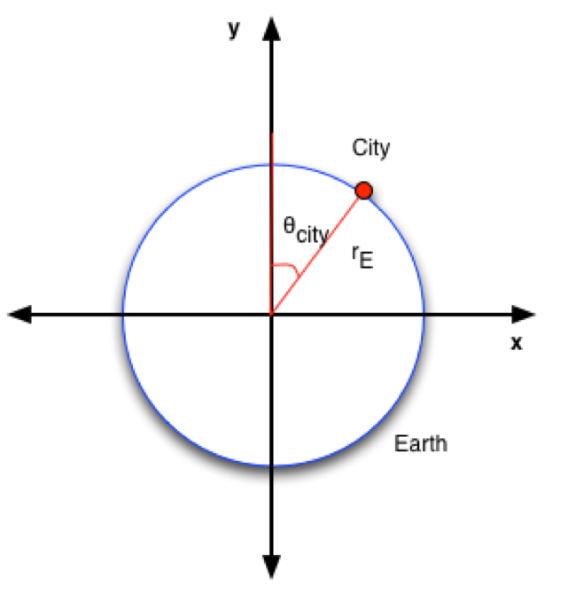
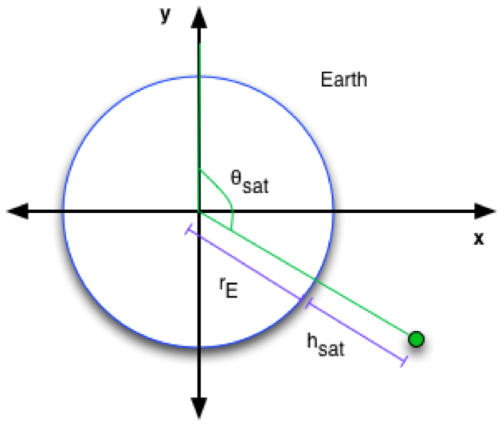
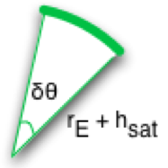

## Lab05 - Challenge Exercise - GPS Blackout (4 points)

So much of today's technology uses *Global Positioning System* (GPS) information, for tasks such as tagging photographs with the location where they were taken, guiding drivers with car navigation systems, and even for missile control systems. There are currently 31 active GPS satellites orbiting the Earth, providing near constant GPS coverage.

Even though I don't get mobile phone reception in my living room at home, I can still get constant GPS coverage. In this problem, you are going to write a Flask server to discover what locations on the Earth spend the most time without good GPS coverage.

In order to do this, we are going to have to make some large assumptions. We will assume that:

* The Earth is 2D, and is a perfect circle of radius `6353` kilometres (rE)
* The Earth does not rotate
* The satellites orbit only in 2D space - this problem is in 2D, not 3D.

### Flask Server

You will need to write a flask server in `server.py` with routes according to the following specification. The logic will need to be put into a seperate file called `blackout.py`.

|Function Name|HTTP Method|Parameters|Return type|Exceptions|Description|
|------------|-------------|----------|-----------|----------|----------|
|<code>/city</code>|POST|<ul><li>name</li><li>theta</li></ul>| {} |None|Where name is the name of the city and theta is the angle in radians of the city on the Earth. This angle is relative to the y-axis, rotating clockwise. This is illustrated in Figure 1.|
|<code>/satellite</code>|POST|<ul><li>height</li><li>velocity</li><li>theta</li></ul>| {} |None|Where height (h-sat) is the height, in metres of the orbit of the satellite above the surface of the Earth; velocity is the speed, in metres per second at which the satellite is moving and theta is the initial angle in radians of the satellite, taken clockwise relative to the y-axis. Figure 2 depicts this visually.|
|<code>/simulate</code>|GET|None|<code>{'cities': [(city_name, blackout_intervals)]}</code>|None|See below|
|<code>/clear</code>|DELETE|None|{}|None|Clears all cities and satellites.|

##### Figure 1



##### Figure 2



The velocity of the satellite is defined to be the arc-length distance that the satellite moves per second. The image below demonstrates this. If the sattelite has an orbit velocity of 3500 metres per second, then the bold arc would be 3500 metres. δθ here is the change in theta that occurred to move the 3500 metres.



Each second, θ_sat is increased by δθ.

### Task

Your server will need to be able to read in the satellites and cities, and then run a simulation. You need to simulate the movement of the satellites over a single 24-hour period. You will simulate their movements in increments of 1 minute, so there will be `24 x 60 = 1440` steps in total in your simulation.

At each step, you need to work out which satellites are visible by each city. For a satellite to be visible by a city, the line between the city and the satellite needs to not cross through the Earth. This line is allowed to cross through other satellites though.

You should use the following pseudocode for updating positions and checking for visibility when `/simulate` is called:

```
for each step of the simulation:
    update the position of each satellite
    check which satellites each city can see

for each city:
    add count for city into list

return list
```

### `/simulate` Output

After you have run your simulation, you need to return for each city, how many 1 minute intervals they could not see any satellites for. The higher this number, the worse GPS coverage that city has. Each city needs to have a tuple of the format `(city name, number of blackout intervals)` which is returned in the list, inside a dictionary as stated above.

The cities need to be in the list in alphabetical order.

### Example

```
/city POST {'name': 'City1', 'theta': 2.827433388230814}
/city POST {'name': 'City2', 'theta': 0.9424777960769379}
/satellite POST {'height': 20183000.0, 'velocity': 3874.0 'theta': 3.141592653589793}
/satellite POST {'height': 5100000.0, 'velocity': 5000.0, 'theta': 0.2345}
/simulate
{ 'cities': [['City1', 634], ['City2', 531]] }
```

### Debugging

There is a visualiser to help you debug your program. You can access the visualiser and its documentation [here](https://groklearning.github.io/problem-helpers/gps-blackout/).

### Comparing Floats

To compare the equality of two floating point numbers in your code, you should use the following function:

```python
def feq(a, b):
  return abs(a - b) <= 1e-6

n = 0.1 + 0.1 + 0.1
print(n) # => 0.30000000000000004
print(n == 0.3) # => False
print(feq(n, 0.3)) # => True
```

### Maths Help

#### Arc Length

The length `l` of an arc on a circle can be computed via the fomula `l = rθ`, where `r` is the radius of the circle and `θ` is the size of the angle in radians.

#### Equation of a Circle

The equation of a circle in 2D Euclidean space, centred at `(0, 0)` with a radius `r` is `x^2 + y^2 = r^2`

#### The Quadratic Formula

The quadratic formula for discovering the two solutions to a quadratic equation of the form `ax^2 + bx + c = 0` is


If the value of the discriminant `b^2 - 4ac` is negative, then the quadratic equation has no solutions in the space of the real numbers.

Problem Sourced from Grok Learning NCSS Challenge Advanced, 2016.


### Hints

1. Solve this problem by reading/writing to a file first - the Flask is the easy part and can be done after. `input.txt` provides an example case given as input.
2. There are several ways to solve this problem
    * One approach involves using vectors
    * One approach involves using a Quadratic
    * One approach involves using the angle between the city and the satellite
