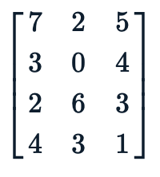
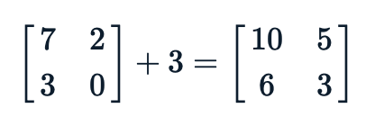
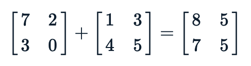
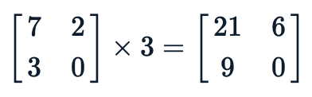
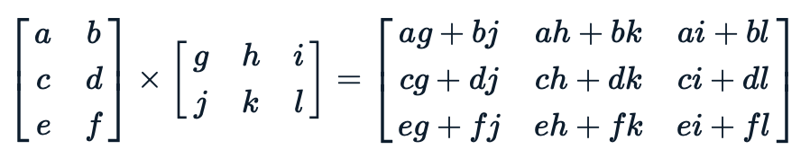
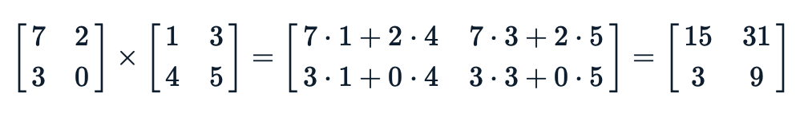

## Lab09 - Exercise - The Matrix (3 points)

As well as being a [mental prison for all of humanity](https://en.wikipedia.org/wiki/The_Matrix), the *matrix* is a fundamental mathematical object used across the sciences. Matrices are arbtrarily sized rectangular arrays that typically contain numbers. In this question, we will be building a Python class to store and manipulate a basic matrix.

Matrices have `m` rows and `n` columns. The example matrix has 4 rows and 3 columns. Tuple indices are used to access the elements: the number 7 has the index `(0,0)` and the number `6` has the index `(2,1)`.

Matrices can be added to *scalar* values or other matrices. When adding a matrix with a scalar, you simply add the numerical value to everything in the matrix.

When adding a matrix to another matrix, both matrices must have the same dimensions. Each corresponding value in the matrices are summed together to form the result.

Matrices can be multiplied by scalar values or other matrices. In the scalar case, you multiply the numerical value through the matrix:

Multiplying two matrices together is a little harder - it is an order-dependent operation, wehre `A x B` is not necessarily the same as `B x A`. The left-hand matrix `A` must have dimensions `(m,n)` and the right-hand matrix `B` must be `(n,p)` - the number of columns in the first matrix is equal to the number of rows in the second.

The *result matrix* will have dimensions `(m,p)`. The `(i,j)`-th entry in the result matrix is the *sum* of the pairwise products of the row from the *i*-th row of the first matrix and the *j*-th column in the second.

A concrete example:

In `matrix.py` there is a template for a matrix class with method stubs. Complete the stubs, following the instructions in the function docstrings.

Problem sourced from Grok Learning NCSS Challenge (Advanced), 2015.
