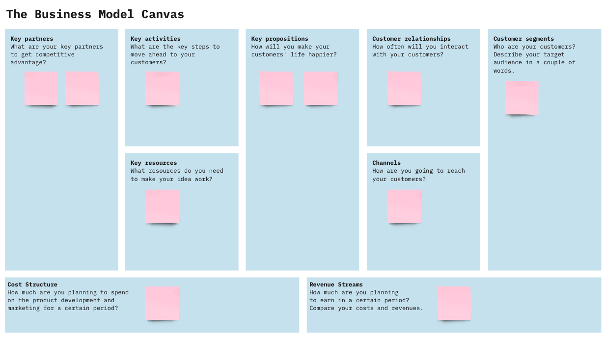

## Lab10 - Exercise - Canvas

In this exercise, we are going to take a step back and consider the broader context of an app like UNSW Streams. Imagine that for the last ten weeks you've been working as Software Engineers as part of a business that has been developing the application. Now, you will need to put yourself in the shoes of someone who oversees a project like this and think about what goes into the initial planning before building a product like UNSW Streams - what is our product? Why are we developing it? What gap in the market are we filling? How will we attract users? What competitor products are there?

Fill out the following Business Model Canvas (BMC) based around your business and product. You can be as creative as you like in coming up with some of the contextual details, within reason. Section 2.0 of the project specification may be helpful for this exercise.

[Miro](https://miro.com/app/dashboard/) is a good free online tool for developing visuals like these.
