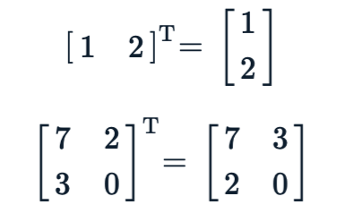

## Lab10 - Exercise - The Matrix Reloaded

Back in Week 4 we created a simple `Matrix` class. This week, we will extend this class to add some new matrix operations. We'll also take advantage of python's *magic methods* in classes to make the class act like one of Python's builtin objects. Starter code and function docstrings have been provided in `matrix.py`.

### New Functionality

Add a `transpose` method to calculate the *transpose* of a matrix `mT`. The transpose operation swaps the rows and columns of the matrix like this:



### Refactoring and Extensions

Change the methods you defined in your `Matrix` class to magic method equivalents that let you use Python's builtin operators: `__add__`, `__mul__`, `__getitem__` and `__setitem__`. As an extension, you should also add the `__iadd__` for inplace addition. These magic methods are implicitly called by Python in the following situations:

```python
x = m1[0,0]   # Calls m1.__getitem__((0,0))
m1[1,0] = 4   # Calls m1.__setitem__((1,0), 4)
m3 = m1 + m2  # Calls m1.__add__(m2)
m3 = m1 * m2  # Calls m1.__mul__(m2)
m1 += m2      # Calls m1.__iadd__(m2)
```

Finally, modify your `__getitem__` and `__setitem__` methods to add support for `Ellipsis` slicing. Instead of purely integral indicies `(i,j)` or one of `i` or `j` can be the special value `...`, indicating the *entire* row or column, as follows:

```python
x = m1[...,0]  # x is a list containing a copy of the 0th column of m1
y = m1[1,...]  # y is a list containing a copy of the 1st row of m1
m1[1,...] = (1,2,3,4,5)  # Set the 1st row of m1.
m1[...,0] = [3,4,5]      # Set the 0th column of m1.
```

Note that:

* `Ellipsis` slicing should be added *in addition* to the existing integer index support in `__getitem__` and `__setitem__`.
* There are some new exceptions for `__getitem__` and `__setitem__` you will need to support which are outlined in the function docstrings

You should retain the `__init__` and `__str__` methods from the first exercise.

### Hints

1. Be careful of [side effects](https://www.youtube.com/watch?v=7AZhjQjYX9w)
2. `Ellipsis` is something of an oddity in Pyhton - it acts a lot like `None`. You can check if a value is an `Ellipsis` via the `is` keyword:

```python
>>> x = 'hello'
>>> x is Ellipsis
False
>>> x = ...
>>> x is Ellipsis
True
```

Problem sourced from Grok Learning NCSS Challenge (Advanced), 2015.
