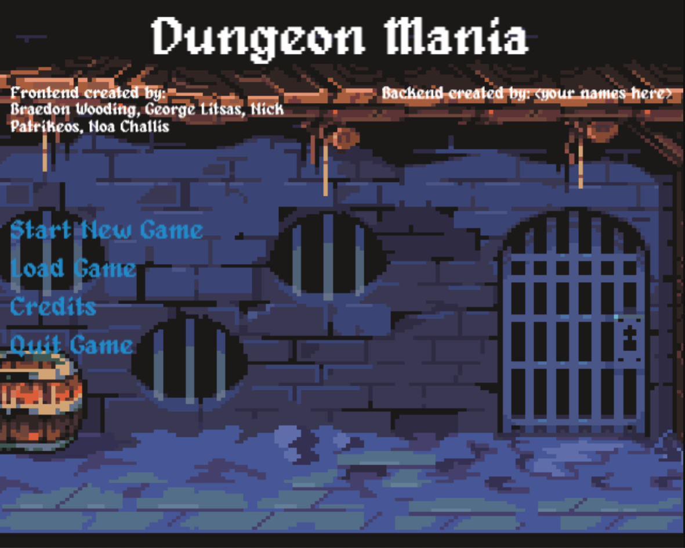
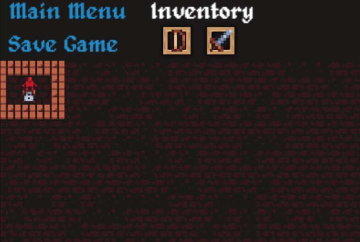
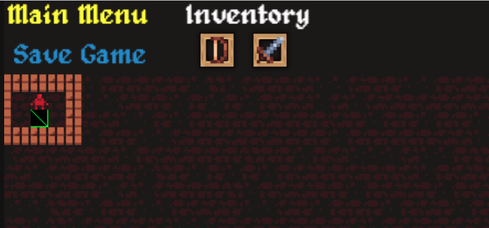
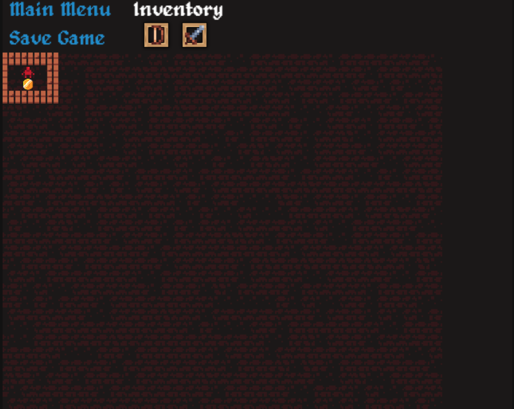
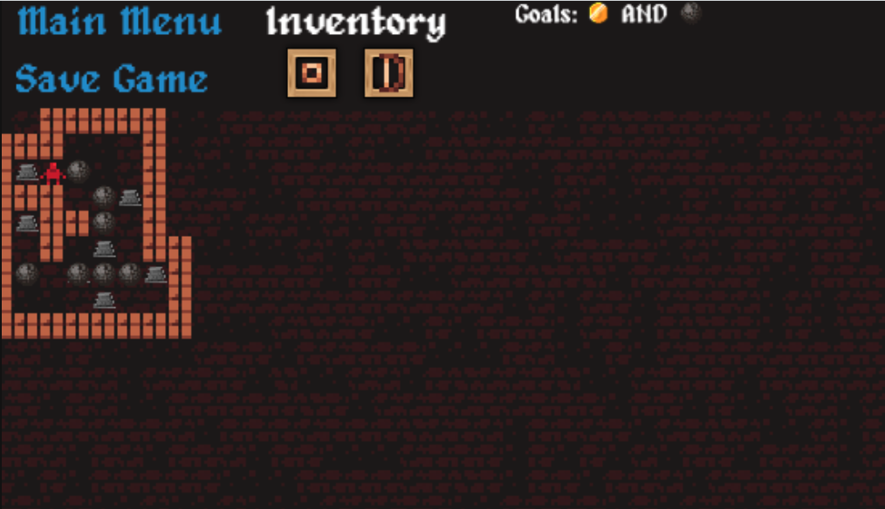
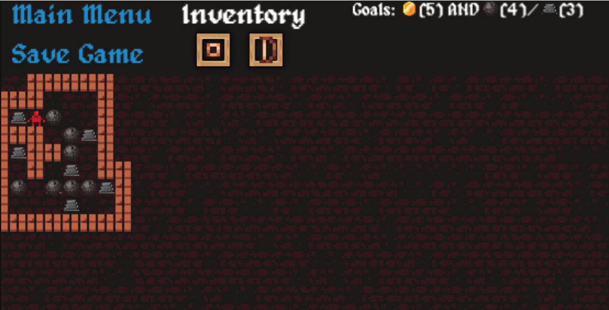
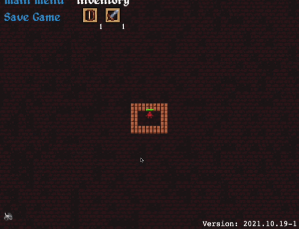

[[_TOC_]]

# Influencing the look of the game and controlling rendering

> This will factor mainly into Milestone 3, but you're welcome to make customisations as part of Milestone 2

Learning how to interact with an already built (and potentially clunky) system, is a critical part of the design experience, and one we want to encourage through this course.

## Localisation/Changing Text

Let's begin with a very simple example, we are going to add your name to the main menu AND change an image :D.

Firstly, make sure your project is entirely setup.  Then what we want to do next is run the project as is.  You won't be able to do anything overly fancy without any code but we'll atleast be able to see how the system works, by faking a world state.

When you run the project you'll see a screen like below;



Let's change the second subtitle (the one that says `Backend created by <your names here>`).  How do we do this?  Well it's actually extraordinarily easy!  We don't even need to rerun the application.

We just need to find a file called `src/main/resources/languages/en_US.json` (currently we have no language selector, but that may be a requested feature that we'll implement in the future).  We've copied the file below for your reference.

```json
{
    "main_menu": {
        "font": "alagard.ttf",
        "title": "Dungeon Mania",
        "subtitle_1": "Frontend created by:\n Braedon Wooding, George Litsas, Nick Patrikeos, Noa Challis",
        "subtitle_2": "Backend created by: <your names here>",
        ...
    },
    "game": {
        ...
    }
}
```

> For brevity `...` is used to show that there is more but irrelevant content in a file.

You'll notice there is a *TON* we can do here, from changing the font, to changing titles, to changing pretty much every bit of text in the game!  Let's change `subtitle_2`, don't add your whole teams name, try to just add yours (becareful of merge conflicts so you may want to do it in a bit more of a co-ordinated way).  Then reload the page, and tada it's been updated!

## Getting the map to render a very simple world

Next we are going to just hard code an extremely trivial world, we won't be able to use the arrow buttons (since we won't be writing anything for `tick` where movement is processed) but we'll be able to atleast load a simple world.

First look at the following world and pick out the details of the player and the surrounding area, they are fully covered in walls, and have a door next to them.



The code to generate this is as follows and should be placed in `newGame`.  This is very rough code and is just for demonstration purposes.

What the code does is manually build the entities for the world.

```java
public DungeonResponse newGame(String dungeonName, String gameMode) throws IllegalArgumentException {
    List<EntityResponse> entities = new ArrayList<>();
    
    // let's generate some walls
    /**
        * 
        *  WWWWW
        *  W P W
        *  W D W
        *  WWWWW
        * 
        * where P is the player, D is a door, and W is some walls
        */

    for (int x = 0; x < 5; x++) {
        for (int y = 0; y < 4; y++) {
            if (x == 0 || y == 0 || x == 4 || y == 3) {
                // only generate borders
                entities.add(new EntityResponse("entity-" + x + " - " + y, "wall", new Position(x, y, 2), false));
            }
        }
    }

    // now to add the player and coin
    entities.add(new EntityResponse("entity-player", "player", new Position(2, 1, 2), false));
    entities.add(new EntityResponse("entity-door", "door", new Position(2, 2, 2), false));
    
    return new DungeonResponse("some-random-id", dungeonName, entities, Arrays.asList(new ItemResponse("item-1", "bow"), new ItemResponse("item-2", "sword")), new ArrayList<>(), "");
}
```

However, when running this (make sure to stop / start the server since you are making code changes), you'll find that the door doesn't render, you get this weird sort of green rectangle?  Why?  Well this is because it failed to find the asset for the door!



Let's go and add it, we just have to go to `src/main/resources/skins/default.json` which you'll notice looks something like below;

```json
{
    "main_menu": {
        "background_image": "images/backgrounds/main_menu.png",
        "text_color": "white"
    },
    "game": {
        "background_image": {
            "images/tileset/walls/wooden/wood_floor_0.png": 5,
            "images/tileset/walls/wooden/wood_floor_1.png": 7,
            "images/tileset/walls/wooden/wood_floor_2.png": 10,
            "images/tileset/walls/wooden/wood_floor_3.png": 2
        },
        "resolution_px": 16,
        "item_box": "images/ui/box.png",
        "text_color": "white"
    },
    "entities": {
        "boulder": "images/tileset/entities/boulder_00.png",
        "bow": "images/tileset/items/bow_0.png",
        "player": "images/tileset/entities/entity.png",
        "bomb": "images/tileset/items/bomb.png",
        ... (a ton of entities)
    }
}
```

> Small note, you can change the `resolution_px` to change how big all the assets are rendered, this can help if you want to render high resolution images.

Just add a new line (remembering to put a comma on the previous line) such as below;

```diff
    "entities": {
        "boulder": "images/tileset/entities/boulder_00.png",
        "bow": "images/tileset/items/bow_0.png",
        "player": "images/tileset/entities/entity.png",
        "bomb": "images/tileset/items/bomb.png",
        "wood": "images/tileset/entities/box_wood.png",
        "arrow": "images/tileset/items/arrow_0.png",
        "exit": "images/tileset/entities/stairs_down.png",
        "treasure": "images/tileset/items/treasure_0.png",
        "wall": "images/tileset/walls/wooden/wood_bottom.png",
        "spider": "images/tileset/entities/spider_00.png",
        "mercenary": "images/tileset/entities/ranger.png",
        "switch": "images/tileset/floor_switch.png",
        "invincibility_potion": "images/tileset/items/potion_10.png",
-       "sword": "images/tileset/items/sword_silver.png"
+       "sword": "images/tileset/items/sword_silver.png",
+       "door": "images/tileset/walls/wooden/door_locked_silver.png"
    }
```

Notice the comma on the sword line.  We give you tons of images to start with (most are named and categorised, some are left up to you to name/categorise if you want).  You can also find your own images/assets (and are somewhat encouraged!).

Once we do that, we don't even need to restart! 


Maybe try to change the example so it renders a bit of treasure instead!  Look around and see what you can find for the entity types and so on.  You should end up with



From this point you've been able to create a simple world, and change a couple of images, there are tons more to learn.  Such as tilesets and all.

## Some other comments about this

As you've probably noticed, the frontend doesn't really know what an "entity" is, it just knows that you want to render some images, furthermore there are surely some questions about the 3rd parameter to the position.  This is called the `layer` and allows you to positionally place entities ontop of each other.

As a more indepth explanation... we can talk about 'z sorting' which is how you sort which entity / image should appear above or below which other entities.  The way this is exposed to you is through the use of a third axis `z` or `layer`.  That is for example the position `(1, 1, 0)` would be at `x = 1, y = 1` and at the layer `0` which is below `(1, 1, 1)` for example.  It's recommended you standardise layers (i.e. place all items on the same layer, and so on...) rather than just randomly guess in each one.  Entities are allowed to move between layers.

# Reference

This project offers a lot of flexibility for you to customise the game's visuals/audio/mechanics to what you want.  The only important consideration is that you shouldn't reduce the complexity of the solution (that is you can make lateral changes but can't simplify how a certain mechanic works).

In order to help you, the frontend is extremely flexible and offers you the ability to define the following;
- Different images for every graphic
- Styling (colours/fonts/...)
- Animations & Audio Cues during events

The system is intentionally not made to be perfect and you may have to work around some awkward design choices (as you would have to in real life) to come up with a clean and simple solution.

# Changing graphics and styling

| :information_source:  NOTE: This is more intended for Milestone 3 where you'll get marks for doing extensions like this, but feel free to start in Milestone 2 if you find time. |
| --- |

To enable alternate graphics you need to setup the concept of a "skin.json" file; these are JSON files that allow you to customise graphics.  An example is shown below;

```json
{
    "main_menu": {
        "background_image": "images/MyFile.jpg",
        "text_color": "rgb(255, 0, 0)"
    }
}
```

The default skin (`src/resources/skins/default.json`) will show you all the various things you can change, note that entities (tiles/characters/items/...) aren't listed in the skin since their icon is specified as part of the entity itself.

## TileSets

Sometimes you want to randomise images based on some weighting, you can do this through the use of tilesets.  From the default asset file.

```json
        "background_image": {
            "images/tileset/walls/wooden/wood_floor_0.png": 5,
            "images/tileset/walls/wooden/wood_floor_1.png": 7,
            "images/tileset/walls/wooden/wood_floor_2.png": 10,
            "images/tileset/walls/wooden/wood_floor_3.png": 2
        },
```

You can think of each of those numbers as the amount of raffle tickets that asset bought, when we go and pick out the winner if you are have more tickets you are more likely to win (and be rendered), so it's not percentage based.  This makes it much more convenient to extend these lists and just generally is nicer to work with.

## Goals

You'll probably want to render goals correctly at some point, like below;



It's actually a lot easier than you might think!  The above example is literally just `":treasure AND :boulder"` (literally go and hardcode it in your dungeon response and see!).  How, this works is that any bit of text that is prefixed with `:` in goals will resolve to an image rather than raw text.  The image typically being the entity type.  You can do some pretty funky stuff here such as the following; `":treasure(5) AND :boulder(4)/:switch(3)"` (to indicate that we have 5 pieces of treasure to pickup, 3 switches to hold down left, and 4 boulders that we *can* use).



### How to signal that the game has finished

You can signal that the game has finished by returning an empty string of goals.  This will only cause it to trigger an end game alert *IF* you've previously sent goals for that game.

## Defining Animations & Audio Cues

You can define a series of animation/audio cues to play during specific events in 2 ways, one is reactive and the other is proactive.

### Through the skin file

> A few concessions around music are; it won't play when the tab isn't active, you'll have to click on the game atleast once for the music to start playing if you are on a chromium browser (this is a restriction put in place by Chrome).  There is also a little mute button on the bottom left.  Also VLAB doesn't support audio.

You can specify background music through the skin file as follows;

```json
{
    "main_menu": {
        "background_music": "audio/myMusic.mp3"
        ...
    },
    "game": {
        "background_music": "audio/otherMusic.mp3"
        ...
    }
}
```

We support; mp3's and ogg's.  Keep in mind that in Firefox mp3's may not work so you may want to convert them to ogg's.  If you 

> The actual folder name here doesn't matter (funnily enough as long as they sit inside `src/resources` the path is purely for style reasons)

The default skin (`src/resources/skins/default.json`) will show you all the various things you can change.  This includes most events such as clicking on a button or background music.

#### Randomising Audio

You can randomise audio through the use of a tileset like configuration as per before...

```json
{
    "main_menu": {
        "background_music": {
            "audio/a.mp3": 3,
            "audio/b.mp4": 10
        }
    }
}
```

Once a randomised track has finished it'll randomly pick the next one to play.  It won't however play the same song twice (unless that's the only song).

### Animations

Animations are a useful part of a modern application, and the frontend has (albeit limited) support for them.  Animations are defined *on* an entity and persist for the specified frame.

## A simple health bar

Taking the example from before we can generate a very simple healthbar as follows;

```java
public DungeonResponse newGame(String dungeonName, String gameMode) throws IllegalArgumentException {
        List<EntityResponse> entities = new ArrayList<>();
    
        // let's generate some walls
        /**
            * 
            *  WWWWW
            *  W P W
            *  W D W
            *  WWWWW
            * 
            * where P is the player, D is a door, and W is some walls
            */
    
        for (int x = 0; x < 5; x++) {
            for (int y = 0; y < 4; y++) {
                if (x == 0 || y == 0 || x == 4 || y == 3) {
                    // only generate borders
                    entities.add(new EntityResponse("entity-" + x + " - " + y, "wall", new Position(x, y, 2), false));
                }
            }
        }
    
        // now to add the player and coin
        entities.add(new EntityResponse("entity-player", "player", new Position(2, 1, 2), false));
    
        List<AnimationQueue> animations = new ArrayList<>();
        // Arguments are;
        // - when (unused for now, just specify "PostTick")
        // - entityId (unique id that corresponds to what entity you want to animate)
        // - queue (queue of actions)
        // - loop (do you want the animation to loop)
        // - duration (how long do you want the animation to last, any negative value is infinite)
    
        // In this case it creates 2 animations on the player
        // the first one sets the healthbar to 0.8 (from 0 to 1 inclusive)
        // the second animates the healthbar down to 0.5 over a period of 0.5 seconds
        // The format is specified strictly in the next section.
        animations.add(new AnimationQueue("PostTick", "entity-player", Arrays.asList(
            "healthbar set 0.8", "healthbar tint 0x00ff00", "healthbar set 0.2, over 1.5s", "healthbar tint 0xff0000, over 0.5s"
        ), false, -1));
    
        // To make it a bit more interesting we'll shake the healthbar
        // 'shake' will apply some random rotation/scale, '0x00ff00' is green.
        // these effects will last 0.5s
        animations.add(new AnimationQueue("PostTick", "entity-player", Arrays.asList("healthbar shake, over 0.5s, ease Sin"), false, 0.5));
        
        return new DungeonResponse("some-random-id", dungeonName, entities, Arrays.asList(new ItemResponse("item-1", "bow"), new ItemResponse("item-2", "sword")), new ArrayList<>(), "", animations);
}
```

> NOTE: You'll notice that you are creating the animations *EVERY* time.  Think about how you can abstract this nicely.

This results in the following (gif below);



### A more crazy example!

Replace the animation creation code with the following.  In this case we keep the healthbar but cause it to loop for 10s before stopping, as well as swapping the player sprite out and moving them along the x-axis.

```java
        animations.add(new AnimationQueue("PostTick", "entity-player", Arrays.asList(
            "healthbar set 0.8", "healthbar tint 0x00ff00", "healthbar set 0.2, over 1.5s", "healthbar tint 0xff0000, over 0.5s"
        ), true, 10));
    
        // In this case, we'll replace the player with a boulder, and move it horizontally across slowly.
        // You could play an animation by swapping out sprites as it moves.
        animations.add(new AnimationQueue("PostTick", "entity-player", Arrays.asList("healthbar shake, over 0.5s, ease Sin", "tint 0x00ff00", "translate-x 1, over 2s", "sprite boulder"), false, 0.5));
```

> Notice how the healthbar follows the player, as it gets translated around.


| :warning:  NOTE: If processing movement, it's recommended that you return the final position in the entity response object, and then process movement by doing a translation (of duration 0s) back to the old position then translate them back to the final position.  i.e. `translate-x -1, over 0s` followed by `translate-x 1, over 2s` |
| --- |

## A more detailed specification

An animation queue is a very *trivial* set of actions that can be performed on entities.  The class structure is as follows;

```java
public class AnimationQueue {
    /** _when_ should this animation play?  Currently unused, but should be "PostTick" */
    private final String when;

    /** The entity to perform this on */
    private final String entityId;

    /** List of actions to perform (more info below) */
    private final List<String> queue;

    /** If true, will repeat all animations once all in queue are completed. */
    private final boolean loop;

    /** If loop is specified, will repeat animation until total elapsed is approximately specified duration */
    private final double duration;
}
```

> AnimationQueue.java

```
public AnimationQueue(String when, String entityId, List<String> queue, boolean loop, double duration);
```

There is also an overload for DungeonResponse that takes in an animation queue.

```
public DungeonResponse(String dungeonId, String dungeonName, List<EntityResponse> entities,
            List<ItemResponse> inventory, List<ItemResponse> buildables, String goals,
            List<AnimationQueue> animations)
```

### All Possible Actions

You'll probably be using really just entityId/queue to setup unique animations.

Actions within a queue use spaces and commas to separate arguments, so make sure you match the format exactly.  Actions are 'interpolated' (transitions between the old and new states).

The following are all the available commands for healthbar;

- `healthbar` manipulate the healthbar in some way...
  - `healthbar set <amount>` will set the healthbar progress, amount has to be in the region `0 <= amount <= 1`
  - `healthbar shake` shakes the healthbar
  - `healthbar scale <amount>` scales the healthbar to the amount specified
  - `healthbar tint <color>` sets the color of the healthbar to the hexcode specified i.e. `0xff00ff`

The following are all the available commands for entities in general;

- `sprite <entity-type>` override the sprite used, will ignore both `ease` and `over` modifiers.  Looks up the sprite through the entities mapping in default.json
- `tint <hex>` tints a sprite to the specified hexcode colour.
- `rotate <degrees>` rotates sprite by specified degrees
- `scale <ratio>` will set the entities scale to the specified ratio.
- `scale-x <ratio>` will set the entities horizontal scale to the specified ratio.
- `scale-y <ratio>` will set the entities vertical scale to the specified ratio.
- `translate-x <x>` will translate the entity along the x-axis, scales such that `translate-x 1 == resolution`
- `translate-y <x>` will translate the entity along the y-axis, scales such that `translate-x 1 == resolution`
- `set-layer <layer>` allows you to change the entities layer to place it above other entities visually.  This *SETS* the layer.
