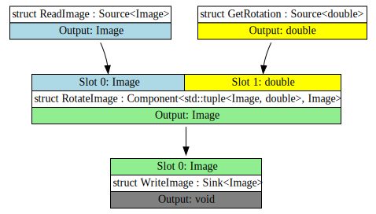
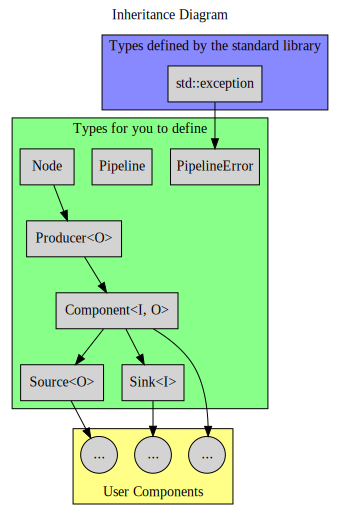
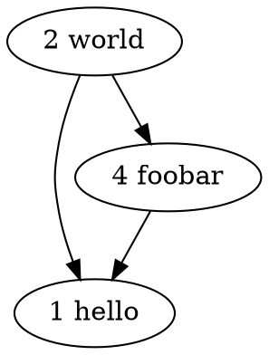
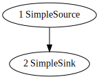

# Assignment 3: A dataflow pipeline

## Changelog
- (2023-04-13): Added some more clarifications:
  - Extended deadline
  - A major hint in the hints section for validation
  - Solidified the requirements around a valid pipeline (added one clause)
  - Fixed up the order of throwing exceptions in `pipeline::connect`
  - Clarified when `node::connect` can receive a `nullptr`
  - Added general wording improvements across the spec.
- (2023-04-10): Added some clarifications:
  - output format for `operator<<` when a node is connected to another node through more than one slot.
  - Some rules about when a pipeline is valid or not.
  - Some fixed up wording for `pipeline::disconnect()` and `pipeline::get_dependencies()` relating to only affecting immediately connected nodes.
  - Fixed up wording for `run()` begin equivalent to `while(!step()) {}`.
  - Adding a small note about `concrete_node`'s requirements.
- (2023-04-07): Added one more case for throwing in `pipeline::connect`
- (2023-03-29): Fixed the "getting started" link
- (2023-03-27): Initial Release.


## 1. Table of Contents

[[_TOC_]]


## 2. Overview

"Dataflow programming" is a programming paradigm where a program is modeled as a directed graph of data flowing between operations. This model has a number of benefits, especially when writing distributed programs operating on many parallel streams of data.

In this assignment, you will be implementing a simplified dataflow pipeline library, making use of both static polymorphism (templates) and dynamic polymorphism (virtual functions and inheritance). Users can then define their own types to be used with this library to perform useful computations.

We represent computations as different types of a `component` template.

A `component<I, O>` has:
- an _input_type_ `I`, a list of types `Ts...` it needs to do its job, represented as a `std::tuple<Ts...>`; and,
- an _output_type_ `O`, which is the type of the result it produces.

We refer to the inputs required for a `component` as _slots_, which are simply integral indices into the list of types needed by the component.
For example, a component that requires an `int` and a `std::string` has two slots: slot **0** must be connected to a `component` that produces `int`s, and slot **1** must be connected to a `component` that produces `std::string`s.

In addition, we have two types to simplify writing special kinds of components:
- `sink<I>`, a component with only one input slot and producing `void` (that is, nothing). It is the end of the pipeline, responsible for 'using' the result.
  For example, a sink might print values to a file, or fill a global `std::vector` with the results.
- `source<O>`, a component producing `O`s that requires no input. It is the start of a pipeline and is responsible for providing input to other components.
  For example, a source might generate a stream of numbers, or read words from a file.

For example, a simple data pipeline receiving images and rotations, and writing appropriately rotated images to the filesystem, might have a structure like this:



The bulk of the work is done by the `pipeline` type.

A `pipeline` creates and manages `component`s, and sets up connections between them, ensuring that all slots are filled with appropriate types and outputs are passed on correctly.

This should form a connected _dependency graph_, which is a special form of acyclic directed graph.

This is like a tree, where branches can rejoin later on.

When run, a `pipeline` will poll each `component` in turn, such that every `component` is run after all its dependencies.
That is, every `component` will be run only after it has input to operate on.
The `pipeline` will finish once there is no more work to do. Like a regular program, and component that can produce values infinitely will also cause the pipeline to run infinitely, but this is something avoided by the user of the `pipeline` rather than a problem for the pipeline itself.

To be able to store and work with any kind of component, without needing to necessarily know the exact component we are working with, we also have two more types.
A `producer<O>` generalises `component<I, O>` over "any component producing `O`s",
and, a `node` generalises `producer<O>` over "any component at all".
(This process of generalising specific types into a single umbrella type
is known as [_type erasure_](https://www.youtube.com/watch?v=tbUCHifyT24).)

In summary, the following diagram shows all the types you will be required to implement in the green box, along with their inheritance relationships (in the form `base -> derived`):




### 2.1 Some Useful Terminology

There are a few terms that are used throughout this document
that you should become initimately familiar with:

* A *graph* is a generalisation of a tree, consisting of _nodes_ (vertices) and _edges_ linking the nodes.
* A *directed graph* is a graph where the edges have orientations. For example, a street map where all roads are one-way.
* A graph is *acyclic* if it has no *cycles*. That is, for every node in the graph there is no sequence of edges that would lead you back to the node you started from.
* A graph is *connected* if there are no 'unreachable' vertices.
* A directed graph is *weakly connected* if you can form a path between any two vertices, ignoring the directions of the edges.
* A *source node* is a node in a graph with no incoming edges.
* A *sink node* is a node in a graph with no outgoing edges.
* A directed edge has a *source*, the node it starts from, and a *destination*, the node it leads to.
  * **Important** Don't get confused between an edge's 'source' and a 'source node'!

Additionally, functions may use the following terms:
- **Preconditions**: things you may assume to be true.
  You do not need to check these.
- **Throws**: when exceptions must be thrown by the function.
  Note: other exceptions may be thrown here by e.g. standard-library types,
  depending on your implementation.
- **Returns**: What the function must return on successful completion.
- **Notes**: Other things that will be relevant to you when implementing the function.

## 3. The Task

The following subsections name a type that you must implement in `src/pipeline.h` and/or `src/pipeline.cpp`.

You should use the declarations in the "Synopsis" code block to start you out when writing your solution.

Note that the synopses are just starter code;
- once again, we have not marked functions `const`, `virtual`, `override`, or `noexcept`. for you.


### 3.1 `pipeline_error`

When constructing a `pipeline` there are various kinds of errors that may occur.

We define an exception type `pipeline_error` to represent these issues.

The kinds of errors are encoded in a `pipeline_error_kind` enumeration class.
Synopsis:
```cpp
// Errors that may occur in a pipeline.
enum class pipeline_error_kind {
  // An expired node ID was provided.
  invalid_node_id,
  // Attempting to bind a non-existant slot.
  no_such_slot,
  // Attempting to bind to a slot that is already filled.
  slot_already_used,
  // The output type and input types for a connection don't match.
  connection_type_mismatch,
};

struct pipeline_error : std::exception {
  explicit pipeline_error(pipeline_error_kind);
  auto kind() -> pipeline_error_kind;
  auto what() -> const char *;
};
```
1. `explicit pipeline_error(pipeline_error_kind kind);`
  - Constructs an error with the given reason.
2. `auto kind() -> pipeline_error_kind;`
  - **Returns**: the kind of error we were constructed from.
3. `auto what() -> const char*;`
  - **Returns**: A string depending on the value of `kind()`:
    - `invalid_node_id`: Return `"invalid node ID"`
    - `no_such_slot`: Return `"no such slot"`
    - `slot_already_used`: Return `"slot already used"`
    - `connection_type_mismatch`: Return `"connection type mismatch"`
  - **Notes**:
    - This is a member function inherited from `std::exception`.
    - The strings do **not** end in a newline.


### 3.2 `node`

A `node` is a type-erased computation.
It is the base class for all `component<I, O>`s, and exposes any common functionality.

You will note that some member functions are specified to be `private`.
This is intentional; it encourages encapsulation by only allowing `pipeline`s to modify `node` states.
However, you can still override `private` virtual functions in derived classes if you want or need to.

Synopsis:
```cpp
// The result of a poll_next() operation.
enum class poll {
  // A value is available.
  ready,
  // No value is available this time, but there might be one later.
  empty,
  // No value is available, and there never will be again:
  // every future poll for this node will return `poll::closed` again.
  closed,
};

class node {
public:
  auto name() -> std::string;

private:
  auto poll_next() -> poll;
  void connect(const node* source, int slot);

  // You may add any other virtual functions you feel you may want here.

  friend class pipeline;
};
```
- `auto name() -> std::string;`
  - **Returns**: A human-readable name for the node.
  - **Notes**: This is a pure virtual function, and must be overriden by derived classes.
- `auto poll_next() -> poll;`
  - Process a single tick, preparing the next value.
  - **Returns**: The state of this node; see `poll`.
  - **Notes**: This is a pure virtual function, and must be overriden by derived classes.
- `void connect(const node *source, int slot);`
  - Connect `source` as the input to the given `slot`.
  - If `source` is `nullptr`, signifies that this node should *disconnect* the existing connection for `slot`. A later call to `connect` with a non-null pointer will later fill that slot again.
  - **Preconditions**: `slot` is a valid index, and
    `source` is either a pointer to a `producer` of the correct type, or `nullptr`.
  - **Notes**: This is a pure virtual function, and must be overriden by derived classes.

As a polymorphic base class, `node` should also have a public `virtual` destructor.


### 3.3 `producer`

This is a very simple type, used to allow inspecting a `component` as a `producer` of a given type, and retrieve a value from it.

Because sink nodes produce no output, you must specialise the `producer` type for when `Output` is `void`.
This specialisation should be identical to the normal template, except that the `value()` function does not exist.

Synopsis:
```cpp
template <typename Output>
struct producer : node {
  using output_type = Output;
  auto value() -> const output_type&; // only when `Output` is not `void`
};
```
- `auto value() -> const output_type&;`
  - **Returns**: an immutable reference to the node's constructed value.
  - **Preconditions**: `poll_next()` has been called and last returned `poll::ready`.
  - **Notes**: This is a pure virtual function; it must be overriden by derived classes.


### 3.4 `component`

A `component` is a single computation in a pipeline.
It is parameterised on the `Input` that it takes, and the `Output` that it generates.

An `Input` must be a `std::tuple` with one type for each slot.
For example, a `component<std::tuple<int, char>, double>` takes one `int` and one `char` as input and produces one `double` as output. The slots are the positionals of the input tuple type: `int` is slot 0 and `char` is slot 1.
These are accessible as member type aliases `input_type` and `output_type`, respectively.

It is up to the `pipeline` to validate that components are correctly connected such that the types of their inputs and outputs match.

Synopsis:
```cpp
template <typename Input, typename Output>
struct component : producer<Output> {
  using input_type = Input;
};
```

### 3.5 `sink` & `source`

These are helper types to assist users in implementing common component types.

A `sink` consumes values but does not produce any; it is the end of one branch of a pipeline.
For simplicity we assume that a sink will only ever have one input slot.

A `source` produces values but does not consume any; it is the start of a pipeline.
Since this type has no slots, we should provide a default implementation for `connect` (to simplify user code and ensure code can compile).

Synopsis:
```cpp
template <typename Input>
struct sink : component<std::tuple<Input>, void> {};

template <typename Output>
struct source : component<std::tuple<>, Output> {
private:
  void connect(const node *source, int slot);
};
```

- `void source::connect(const node* source, int slot);`
  - Provides a default implementation for `node::connect`,
    knowing that this function will never be called.


### 3.6 pipeline

This is the main type, implementing most of the functionality of the system.

A `pipeline` connects arbitrary `node`s together in a data stream.
Each tick, input is created from all sources, flows through intermediary nodes, and ends up at a sink, assuming that every stage succeeded.
Any given `node` is polled at most once every tick. It is possible for a node to not be polled if a parent node polls as closed.

The nodes and connections can be dynamically reconfigured, even between individual process ticks, or after running to completion (which may cause the pipeline to no longer be 'completed').

Almost all `pipeline` operations satisfy at least the "strong exception guarantee":
if any exception is thrown by any member function, for any reason,
it must appear to the caller as if no `pipeline` state has changed.

The only exceptions to this are `step()` and `run()`, which only need to satisfy the "weak exception guarantee": the visible state may change on exception, but no resources should be leaked, and any class invariants must continue to hold.

Synopsis:
```cpp
// The requirements that a type `N` must satisfy
// to be used as a component in a pipeline.
template <typename N>
// 3.6.0
concept concrete_node;

class pipeline {
public:
  // 3.6.1
  using node_id = /* unspecified */;

  // 3.6.2
  pipeline();
  pipeline(const pipeline &);
  pipeline(pipeline&&);
  auto operator=(const pipeline &) -> pipeline&;
  auto operator=(pipeline &&) -> pipeline&;
  ~pipeline();

  // 3.6.3
  template <typename N, typename... Args>
  requires concrete_node<N> and std::constructible_from<N, Args...>
  auto create_node(Args&& ...args) -> node_id;
  void erase_node(node_id n_id);
  auto get_node(node_id n_id) -> node*;

  // 3.6.4
  void connect(node_id src, node_id dst, int slot);
  void disconnect(node_id src, node_id dst);
  auto get_dependencies(node_id src) -> std::vector<std::pair<node_id, int>>;

  // 3.6.5
  auto is_valid() -> bool;
  auto step() -> bool;
  void run();

  // 3.6.6
  friend std::ostream &operator<<(std::ostream &, const pipeline &);
};
```

#### 3.6.0 `concrete_node` Concept

You are required to write a custom `concept` that specifies the requirements for a `component` to be used in a `pipeline`.

A `component` should:
- publish the types it consumes through a public member type `input_type`;
- have a `std::tuple` `input_type`;
- publish the type it produces through a public member type `output_type`;
- be derived from the `node` type;
- also be derived from the appropriate `producer` type;
  - note that the requirement that a component be derived from `node` is automatically met if this requirement is met.
- not be an abstract class (i.e., we can construct it).

#### 3.6.1 Types

- `using node_id = /* unspecified */;`
  - An opaque handle to a node in the pipeline.
    May be any type of your choice as long as it is ["regular"](https://en.cppreference.com/w/cpp/concepts/regular)
    that is, copyable, default-constructible, and equality-comparable.
    **Note**: we expect to be able to create a reasonable number of nodes. Your handle should be able to support at least 256 nodes in the pipeline.
  - We refer to a `node_id` as "invalid" if it is not a valid handle;
    that is, it cannot be used to refer to a node that is currently in the pipeline.

#### 3.6.2 Special Members

- The pipeline must be default constructible.
- The pipeline should **not** be copyable (any attempt to do so should be a compile error).
- The pipeline **should** be movable; after `auto p2 = std::move(p1);`,
  `p2` should manage all the nodes and connections that `p1` used to,
  and `p1` should be left in a valid (but unspecified) empty state. In this state, the pipeline should logically contain 0 nodes.
- You may provide a destructor to clean up if necessary.

#### 3.6.3 Node Management

- `auto create_node<N>(Args&& ...args) -> node_id;`
  - **Preconditions**: `N` is a valid node type (see section 3.6.0),
    and can be constructed from the arguments `args`.
  - Allocates memory for a new `node` with concrete type `N`,
    constructed from the provided `args` parameter pack.
    The new node is initially completely disconnected.
  - **Returns**: a `node_id` that can be used as a handle
    to refer to the newly constructed node.

- `void erase_node(node_id n_id);`
  - Remove the specified node from the pipeline.
    Disconnects it from any nodes it is currently connected to.
  - **Throws**: a `pipeline_error` for an invalid node ID.
  - **Notes**: `n_id` is no longer a valid handle after it is erased.

- `auto get_node(node_id n_id) -> node *;`
  - **Returns**: A pointer to the specified node.
    If `n_id` is invalid, returns `nullptr` instead.
  - **Notes**: You may need more than one overload
    for proper `const`-correctness.

#### 3.6.4 Connection Management

- `void connect(node_id src, node_id dst, int slot);`
  - Connect `src`'s output to `dst`'s input for the given `slot`.
  - **Throws**: in order, if either handle is invalid,
    the destination node's slot is already full,
    the slot number indicated by `slot` does not exist,
    the source output type does not match the destination slot's input type,
    throw the appropriate `pipeline_error`.

- `void disconnect(node_id src, node_id dst);`
  - Remove all immediate connections between the given two nodes.
    If the provided nodes are not connected, nothing is done.
  - **Throws**: a `pipeline_error` if either handle is invalid.

- `auto get_dependencies(node_id src) const -> std::vector<std::pair<node_id, int>>;`
  - **Returns**: A list of all nodes immediately depending on `src`.
    Each element is a pair `(node, slot)`, where `src`'s output
    is connected to the given `slot` for the `node`.
  - **Throws**: A `pipeline_error` if `source` is invalid.

#### 3.6.5 Validation and Execution

Here, a `sink` node `X` is a node that produces no output.
That is, `X::output_type` is `void`.

A `source` node `Y` is a node that takes no input.
That is, `Y::input_type` is `std::tuple<>`.

- `auto is_valid() -> bool;`
  - **Preconditions**: None.
  - Validate that this is a sensible pipeline. In particular:
    - All source slots for all nodes must be filled.
    - All non-sink nodes must have at least one dependent.
    - There is at least 1 source node.
    - There is at least 1 sink node.
    - There are no subpipelines i.e. completely disconnected sections of the dataflow from the main pipeline.
    - There are no cycles.
  - **Returns**: `true` if all above conditions hold, and `false` otherwise.

- `auto step() -> bool;`
  - **Preconditions**: `is_valid()` is `true`.
  - Perform one tick of the pipeline.
    Initially source nodes shall be polled, and will prepare a value.
    According to the poll result:
    - If the node is closed, _close_ all nodes that depend on it.
    - If the node has no value, _skip_ all nodes that depend on it.
    - Otherwise, the node has a value,
      and all nodes that depend on it should be polled,
      and so on recursively.
    The tick ends once every node has been either _polled_, _skipped_, or _closed_.
  - **Returns**: `true` if all sink nodes are now _closed_,
    or `false` otherwise.
  - **Notes**: you are allowed to (but don't have to)
    avoid polling a node if all its dependent sink nodes are closed.

- `void run();`
  - **Preconditions**: `is_valid()` is `true`.
  - Run the pipeline until all sink nodes are closed.
    Equivalent to `while(!step()) {}`, but potentially more efficient.

#### 3.6.6 Visual Representation

- `friend std::ostream &operator<<(std::ostream &, const pipeline &);`
  - **Preconditions**: None.
  - Print a graphical representation of the pipeline dependency graph
    to the given output stream, according to the rules below.

We specify the output using the [Graphviz "DOT" language][http://graphviz.org/documentation/].
Nodes are strings like `"id name"`, where `name` is the result of a call to `node::name()` and `id` is a unique integer, starting at 1, that is incremented for every successful call to `create_node`
for this `pipeline`.
(IDs for nodes that are later removed are skipped.)

Edges are specified like `"1 node" -> "2 node"`:
that is, put an arrow `->` between the names of two nodes.

The output should start with the line `digraph G {`,
be followed by a newline-separated sequence of nodes (each indented two spaces),
then a blank line,
then a newline-separated sequence of edges (again, each indented two spaces),
and finally end with a single `}` and trailing newline.
Nodes and edges should be sorted according to ID.
If a node is connected to another node more than once, two lines should be outputted.

An [example output](./doc/pipeline_print_example.dot) might look like:



You should be able to run this output through
[the `dot` tool provided by Graphviz][http://graphviz.org/download/]
to get a pictorial representation of the pipeline. For example:


### 3.7 `const` Correctness

You must make sure that all appropriate member functions and member operators are `const`-qualified.

You must make sure that each member function and member operator appropriately either has:
- A `const` qualified version only, or
- A non-`const` qualified version only, or
- Both a `const` and a non-`const` qualified version.

Please think carefully about this. The function declarations intentionally do not specify their
constness. Remember also that functions with both `const` and non-`const` overloads may have different return types.

### 3.8 Exception Safety

You must make sure that all functions are `noexcept`-qualified where appropriate.

Please think carefully about what it means for a function to be `noexcept`. It is not enough that the function itself does not throw an exception -- any functions called in the implementation of that function must themselves be `noexcept` or be non-throwing given the domain of the calling function.

Functions that allocate memory are never `noexcept` (why?).

### 3.9 Performance

You must make sure your code does not perform its operations in a grossly inefficient manner.

When testing, we will put a one second time limit on each test.

### 3.10 General Requirements

You must:
- **Implement all types and functions in the `ppl` namespace.**
- Unless otherwise mentioned, **do not** add to the public interface of any types.
  - However, you may add any `private` data members or functions you like, of course.
  - If your templates need helper functions, place them inside the nested namespace `ppl::internal`.
- Use your best judgement, based on principles taught in the course, on
  what should go in the header file versus what should go in the source file.
- No function declarations have been marked `const`, `noexcept`, `virtual`, `override`, etc.
  in this document: make sure to place them on applicable functions correctly.

You must not:
- Write to any files that aren't provided in the repo.
- Add a main function to pipeline.cpp

### 3.11. Example

We have provided an example program in `src/client.cpp` that defines a simple source and sink and uses the above API.

Once you have successfully completed the assignment, the program should compile and produce a `.dot` file that, when ran through `dot -Tsvg client.dot -o client.svg`, should produce the below output.



## 4. Implementation hints

A large portion of the assignment involved understanding templates and dynamic polymorphism.
To that end, here are some tips for dealing with some commong problems:
- You can inspect the properties of a [`std::tuple`][tuple] using [`std::tuple_size_v`][tuple_size] and [`std::tuple_element_t`][tuple_element].
- [`if constexpr`][if_constexpr] is useful for making compile-time decisions.
- Tools like [`typeid`][typeid], [`std::type_info`][type_info]/[`std::type_index`][type_index],
  and/or [`dynamic_cast`][dynamic_cast] may be useful to perform the validation required by `pipeline::connect`.
- To successfully implement the validation required for `pipeline::connect`, you will need to store some kind of information in `pipeline::create_node` and use it in `pipeline::connect`. This information will likely require some kind of metaprogramming and runtime type information.
- You may add any other `virtual` functions to `node` that you like.
  - Just make sure that they aren't pure virtual by the time we get past `component`.
- The [`std::quoted`][quoted] manipulator may be handy for `operator<<(std::ostream &, const pipeline&)`.
- Do lots of testing, especially of strange corner cases!
  - This applies to *all* code!

[tuple]: https://en.cppreference.com/w/cpp/utility/tuple
[tuple_size]: https://en.cppreference.com/w/cpp/utility/tuple/tuple_size
[tuple_element]: https://en.cppreference.com/w/cpp/utility/tuple/tuple_element
[if_constexpr]: https://en.cppreference.com/w/cpp/language/if#Constexpr_if
[typeid]: https://en.cppreference.com/w/cpp/language/typeid
[type_info]: https://en.cppreference.com/w/cpp/types/type_info
[type_index]: https://en.cppreference.com/w/cpp/types/type_index
[dynamic_cast]: https://en.cppreference.com/w/cpp/language/dynamic_cast
[quoted]: https://en.cppreference.com/w/cpp/io/manip/quoted


## 5. Getting Started

If you haven't already done so, clone this repository
```
$ git clone gitlab@gitlab.cse.unsw.EDU.AU:COMP6771/23T1/students/z5555555/ass3.git
```
(Note: Replace z5555555 with your zid)

Navigate inside the directory. You can then begin the assignment.


## 6. Marking Criteria

This assignment will contribute 25% to your final mark.

The assessment for the assignment recognises the difficulty of the task, the importance of style,
and the importance of appropriate use of programming methods (e.g. using while loops instead of a
dozen if statements).

<table class="table table-bordered table-striped">
  <tr>
    <td align=right>50%</td>
    <td>
      <b>Correctness</b><br />
      The correctness of your program will be determined automatically by tests that we will run against
      your program. You will not know the full sample of tests used prior to marking.
    </td>
  </tr>
  <tr>
    <td align=right>25%</td>
    <td>
      <b>Your tests</b><br />
      You are required to write your own tests to ensure your program works.
      You will write tests in the <code>src/pipeline.test.cpp</code> file. Please read the <a href="https://github.com/catchorg/Catch2/blob/master/docs/tutorial.md">Catch2 tutorial</a> or review lecture/lab content to see how to write tests. Tests will be marked on several
      factors. These include, <em>but are not limited to</em>:
      <ul>
        <li>Correctness — an incorrect test is worse than useless.</li>
        <li>
          Coverage - your tests might be great, but if they don't cover the part that ends up
          failing, they weren't much good to you.
        </li>
        <li>
          Brittleness — If you change your implementation, will the tests need to be changed (this
          generally means avoiding calling functions specific to your implementation where possible
          - ones that would be private if you were doing OOP).
        </li>
        <li>
          Clarity — If your test case failed, it should be immediately obvious what went wrong (this
          means splitting it up into appropriately sized sub-tests, amongst other things).
        </li>
      </ul>
      At least half of the marks of this section may be awarded with the expectation that your own tests pass your own code.
    </td>
  </tr>
  <tr>
    <td align=right>25%</td>
    <td>
      <b>C++ Style & Best Practices</b><br />
      Your adherence to good C++ best practices as shown in lectures. This is <b>not</b> saying that if you conform to a style guide you will receive full marks for this section. This 25% is also
      based on how well you use modern C++ methodologies taught in this course as opposed to using
      backwards-compatible C methods. Examples include: Not using primitive arrays and not using
      pointers. We will also penalise you for standard poor practices in programming, such as having
      too many nested loops, poor variable naming, etc.
    </td>
  </tr>
</table>


## 7. Originality of Work

The work you submit must be your own work.  Submission of work partially or completely derived from
any other person or jointly written with any other person is not permitted.

The penalties for such an offence may include negative marks, automatic failure of the course and
possibly other academic discipline. Assignment submissions will be examined both automatically and
manually for such submissions.

Relevant scholarship authorities will be informed if students holding scholarships are involved in
an incident of plagiarism or other misconduct.

Do not provide or show your assignment work to any other person &mdash; apart from the teaching
staff of COMP6771.

If you knowingly provide or show your assignment work to another person for any reason, and work
derived from it is submitted, you may be penalized, even if the work was submitted without your
knowledge or consent.  This may apply even if your work is submitted by a third party unknown to
you.

Note you will not be penalized if your work has the potential to be taken without your consent or
knowledge.

The following actions will result in a 0 mark for this assignment, and in some cases a 0 for
COMP6771:

* Knowingly providing your work to anyone and it is subsequently submitted (by anyone).
* Submitting any other person's work. This includes joint work.

The lecturer may vary the assessment scheme after inspecting
the assignment submissions but it will remain broadly similar to the description above.

<b>PLEASE NOTE: We have a record of ALL previous submissions of this assignment submitted. If you find a solution from a friend, or online, we will find it and you will receive 0 for the assignment and potentially 0 for the course.</b>

Trust me, at least 1 person does it every term and I encourage you not to think you'll get lucky.


## 8. Submission

This assignment is due *~~Monday 17th~~ Friday 21st of April 2023, 19:59:59*.

Our systems automatically record the most recent push you make to your main branch. Therefore, to "submit" your code you simply need to make sure that your main branch (on the gitlab website) is the code that you want marked for this task.

It is your responsibiltiy to ensure that your code can be successfully demonstrated on the CSE machines (e.g. vlab) from a fresh clone of your repository. Failure to ensure this may result in a loss of marks.

## 9 Late Submission Policy

If your assignment is submitted after this date, each hour it is late reduces the maximum mark it can achieve by 0.2% up to 120 hours late, after which it will receive 0.

For example if an assignment you submitted with a raw awarded mark of 90% was submitted 5 hours late, the late submission would have no effect (as maximum mark would be 99%).

If the same assignment was submitted 72 hours late it would be awarded
85%, the maximum mark it can achieve at that time.

This late penalty has been amended from the original specification, and you should not assume it will be the same for future assignments.
